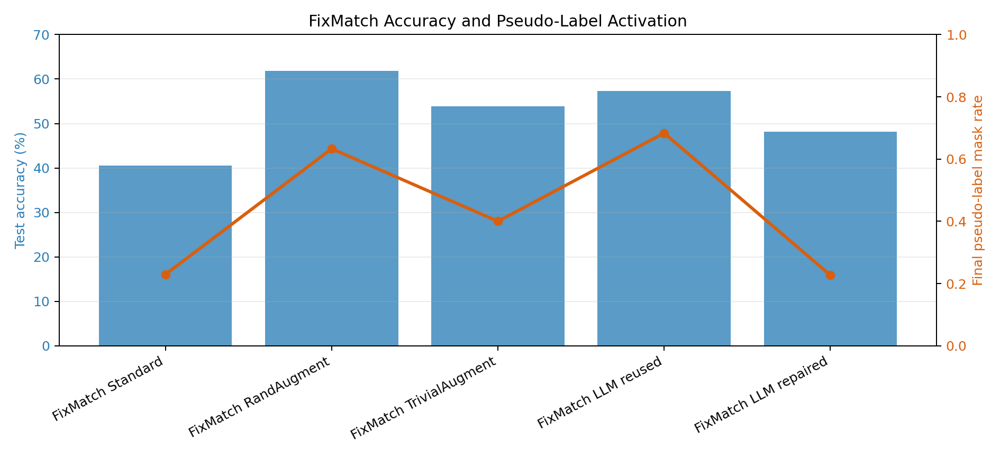

# Final Multi-Seed Experiment Report

Updated: 2026-08-19

## Purpose

This report consolidates the final multi-seed experiments for the dissertation project. Earlier results showed that LLM-guided augmentation evolution could generate valid and interpretable policies, but several key comparisons were based on single-seed runs. The new experiments re-evaluate the most important supervised and FixMatch methods on CIFAR-10 using three matched seeds.

## Supervised Low-Data CIFAR-10

Setting: CIFAR-10 with 100 labelled training images per class, 100 validation images per class, 2,000 test images, `resnet18_cifar`, 15 epochs, and seeds 47, 48, and 49.

| Method | Test accuracy | Test macro-F1 | Validation accuracy | Seeds |
|---|---|---|---|---|
| None | 35.52% +/- 1.15 | 34.47% +/- 1.96 | 37.30% +/- 0.17 | 3 |
| Standard | 44.88% +/- 1.24 | 43.40% +/- 1.42 | 45.57% +/- 2.15 | 3 |
| Mixup | 44.60% +/- 0.68 | 43.47% +/- 0.79 | 45.87% +/- 1.50 | 3 |
| CutMix | 45.70% +/- 1.13 | 43.72% +/- 2.00 | 46.53% +/- 1.86 | 3 |
| RandAugment | 44.78% +/- 3.16 | 43.58% +/- 2.73 | 45.57% +/- 2.37 | 3 |
| TrivialAugment | 39.02% +/- 1.99 | 35.99% +/- 3.90 | 39.00% +/- 2.01 | 3 |
| LLM evolved | 44.83% +/- 1.81 | 43.51% +/- 1.70 | 46.37% +/- 1.97 | 3 |

The best supervised mean accuracy is **CutMix** at **45.70% +/- 1.13**. The LLM-evolved policy reaches **44.83% +/- 1.81**, close to Standard, Mixup, and RandAugment, but below CutMix in mean accuracy. This weakens the earlier single-seed interpretation that the LLM policy nearly matched the best supervised baseline at 48.45-48.50%. The more reliable conclusion is that the supervised LLM policy is competitive with several local baselines, while not consistently outperforming the strongest one.

## FixMatch CIFAR-10

Setting: CIFAR-10 with 100 labelled training images per class, 10,000 unlabelled images, 100 validation images per class, 2,000 test images, `resnet18_cifar`, 15 epochs, FixMatch threshold 0.8, and seeds 61, 62, and 63.

| Method | Test accuracy | Test macro-F1 | Validation accuracy | Seeds | Final pseudo-label mask |
|---|---|---|---|---|---|
| FixMatch Standard | 40.57% +/- 26.78 | 36.96% +/- 30.49 | 41.00% +/- 26.85 | 3 | 0.230 +/- 0.398 |
| FixMatch RandAugment | 61.85% +/- 1.41 | 61.03% +/- 1.72 | 62.67% +/- 1.50 | 3 | 0.633 +/- 0.003 |
| FixMatch TrivialAugment | 53.88% +/- 14.73 | 53.28% +/- 14.50 | 53.77% +/- 15.22 | 3 | 0.400 +/- 0.347 |
| FixMatch LLM reused | 57.27% +/- 2.19 | 56.70% +/- 2.37 | 58.23% +/- 3.31 | 3 | 0.684 +/- 0.009 |
| FixMatch LLM repaired | 48.15% +/- 9.75 | 46.49% +/- 10.33 | 48.60% +/- 12.87 | 3 | 0.227 +/- 0.393 |

The best FixMatch mean accuracy is **FixMatch RandAugment** at **61.85% +/- 1.41**. The reused supervised LLM policy reaches **57.27% +/- 2.19**, which is clearly above the collapsed Standard mean and below RandAugment. The repaired in-loop LLM child reaches **48.15% +/- 9.75** because two of its three runs collapsed after early pseudo-label activation. This revises the earlier single-seed result: the repaired child is not a stable improvement over the reused LLM policy.

## Main Conclusions

The project has now completed a stronger final evidence package. The supervised LLM-evolved policy is competitive but not superior to the best supervised baseline under multi-seed evaluation. In FixMatch, RandAugment remains the strongest and most stable local baseline. The reused LLM policy is a valid and reasonably stable strong-augmentation branch, but the repaired in-loop LLM child is unstable under the current short training budget and constraint-repair design.

The thesis should therefore make a framework-oriented contribution rather than a state-of-the-art performance claim. The defensible claim is that baseline-seeded, ranked, constraint-checked LLM evolution can generate interpretable and runnable augmentation policies, and that empirical validation is essential because single-seed improvements can disappear under multi-seed testing.

## Remaining Work

The code and experiments are now sufficient for a solid dissertation result section. The remaining work is mostly analysis and writing:

- Add a compact ablation table using existing early-stage evidence and, if time permits, run one small no-baseline-seeding or no-ranked-feedback OpenAI ablation.
- Add class-wise analysis for the final supervised LLM policy and FixMatch RandAugment/LLM reused methods.
- Update the thesis Results, Discussion, and Conclusion chapters to reflect the multi-seed findings.
- Avoid claiming that the LLM-generated policy exceeds RandAugment; instead emphasise interpretability, constraint handling, ranked feedback, and the importance of robust evaluation.
