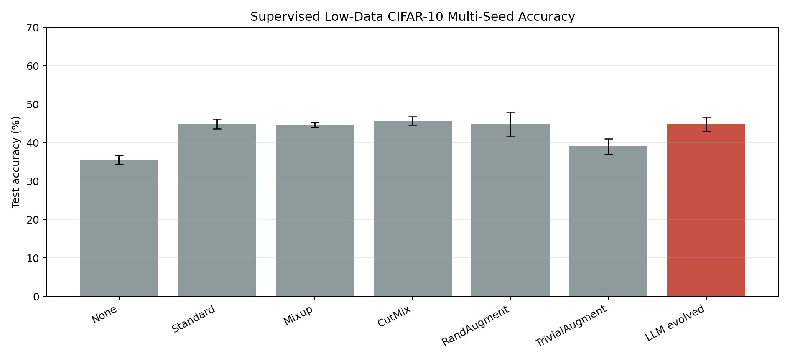
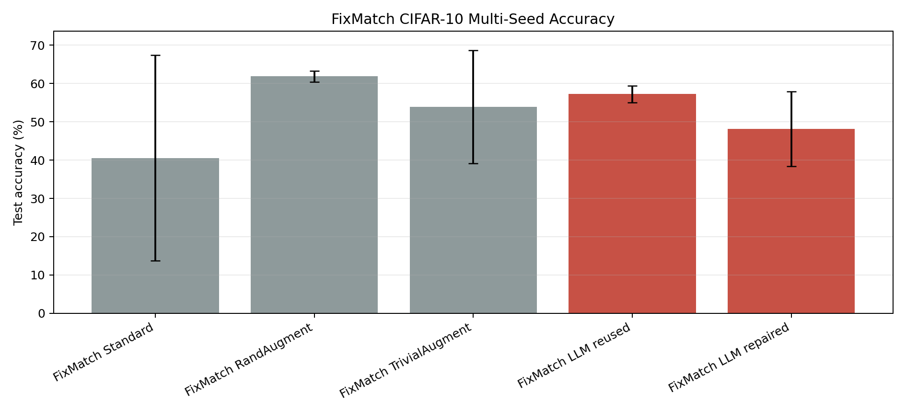
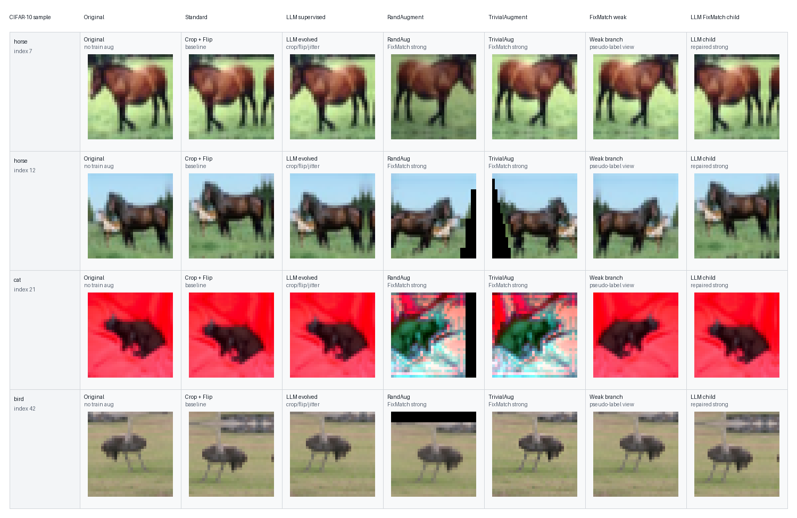
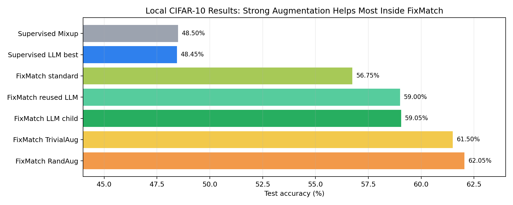

# LLM-Guided Evolutionary Augmentation Search

This repository contains the code, experiment configurations, selected experiment outputs, and documentation for the MSc dissertation project:

**LLM-Guided Evolutionary Search for Data Augmentation Policy Optimization in Low-Data Image Recognition**

The project studies whether large language models can act as semantic mutation and crossover operators for data augmentation policy search. Candidate augmentation policies are represented as constrained JSON objects, validated locally, optionally repaired, evaluated through supervised learning or FixMatch semi-supervised learning, and selected through ranked feedback.

## Repository Contents

- `src/image_aug_evolution/`: implementation of augmentation policies, validators, dataset loaders, model training, LLM policy generation, supervised evolution, and FixMatch-in-the-loop evolution.
- `experiments/`: command-line entry points for running experiments, validating datasets, collecting results, and visualising policies.
- `configs/`: YAML configurations for smoke tests, pilot runs, supervised experiments, OpenAI-guided evolution, FixMatch experiments, and EuroSAT/Flowers102 extensions.
- `results/`: selected CSV/JSON/PNG experiment outputs needed to inspect the current findings. Model weights are intentionally excluded.
- `docs/`: project proposal, project plan, progress reports, visual explanation documents, and draft thesis sections.
- `data/README.md`: dataset download notes. Raw datasets are intentionally excluded from the repository.

## Quick Start

Recommended Python version: 3.10 or newer.

```bash
python3 -m venv .venv
source .venv/bin/activate
python -m pip install --upgrade pip
python -m pip install -r requirements.txt
python -m pip install -e .
```

Run a fast synthetic-data smoke test:

```bash
python -m compileall -q src experiments
python experiments/run_suite.py --suite smoke
```

The smoke suite does not require downloaded datasets or an API key.

## LLM API Configuration

LLM-backed policy generation is optional. Offline heuristic experiments and the standard smoke suite run without any API key. Only configs with `llm.provider: openai` call the OpenAI-compatible client.

Create a private local environment file:

```bash
cp .env.example .env
```

Edit `.env` locally:

```bash
OPENAI_API_KEY=
OPENAI_BASE_URL=
```

Then load it before running OpenAI-backed experiments:

```bash
set -a
source .env
set +a
```

If you use the default OpenAI endpoint, leave `OPENAI_BASE_URL` blank or unset. If you use an OpenAI-compatible provider, set `OPENAI_BASE_URL` to that provider's base URL. The model is configured in each YAML file under `llm.model`; change that field if your endpoint uses a different model name.

For more details, including `api_mode: responses` versus `api_mode: chat`, see `docs/LLM_CONFIGURATION.md`.

## Running Real Experiments

Validate CIFAR-10 loading and the deterministic low-data split:

```bash
python experiments/validate_dataset.py --config configs/cifar10_pilot.yaml
```

Run a small real-data pilot:

```bash
python experiments/run_suite.py --suite pilot
```

Run the stronger supervised OpenAI-guided CIFAR-10 experiment:

```bash
python experiments/run_experiment.py --config configs/cifar10_resnet18cifar_strong_openai.yaml --mode all
```

Run the FixMatch strong-augmentation comparison:

```bash
python experiments/run_experiment.py --config configs/cifar10_fixmatch_llm_strong_policy.yaml --mode fixmatch
```

Run FixMatch-in-the-loop LLM evolution:

```bash
python experiments/run_experiment.py --config configs/cifar10_fixmatch_in_loop_openai.yaml --mode fixmatch_evolution
```

Run the final multi-seed thesis comparisons:

```bash
python experiments/run_experiment.py --config configs/cifar10_final_supervised_multiseed.yaml --mode baselines
python experiments/run_experiment.py --config configs/cifar10_final_supervised_multiseed.yaml --mode policies
python experiments/run_experiment.py --config configs/cifar10_final_fixmatch_multiseed.yaml --mode fixmatch
python scripts/summarize_final_experiments.py
```

OpenAI/LLM configs require `OPENAI_API_KEY` to be set in the local shell or environment. If using the default OpenAI endpoint, leave `OPENAI_BASE_URL` unset. No API key is included in this repository.

## Current Findings

The current local experiments support a focused claim: baseline-seeded ranked LLM evolution can generate valid and interpretable augmentation policies, but stronger semi-supervised baselines such as FixMatch RandAugment remain ahead under the current student-scale search budget. The latest thesis-facing results are based on three matched seeds.

Key CIFAR-10 results:

- Supervised CutMix baseline: 45.70% +/- 1.13% test accuracy.
- Supervised LLM-evolved policy: 44.83% +/- 1.81% test accuracy.
- FixMatch RandAugment: 61.85% +/- 1.41% test accuracy.
- FixMatch reused LLM policy: 57.27% +/- 2.19% test accuracy.
- FixMatch repaired in-loop LLM child: 48.15% +/- 9.75% test accuracy.

See `RESULTS.md` for a fuller summary and links to visual outputs.

## Useful Visuals









## Export Augmentation Examples

Generate a visual grid and individual augmented images from random CIFAR-10 samples:

```bash
python scripts/export_augmentation_examples.py \
  --dataset cifar10 \
  --count 4 \
  --output-dir docs/assets/augmentation_examples/cifar10_demo
```

Generate examples from a custom image:

```bash
python scripts/export_augmentation_examples.py \
  --image path/to/image.jpg \
  --dataset cifar10 \
  --image-size 32 \
  --output-dir docs/assets/augmentation_examples/custom_demo
```

The script saves `augmentation_grid.png`, individual method outputs under `individual/`, and a `manifest.json` describing the samples and methods.

## Reproducibility Notes

The repository includes configurations and result artefacts, but not raw datasets or checkpoints. CIFAR-10, Flowers102, and EuroSAT are downloaded through `torchvision` or configured mirrors when the relevant configs are run.

See `REPRODUCIBILITY.md` for environment details, data notes, and recommended execution order.
