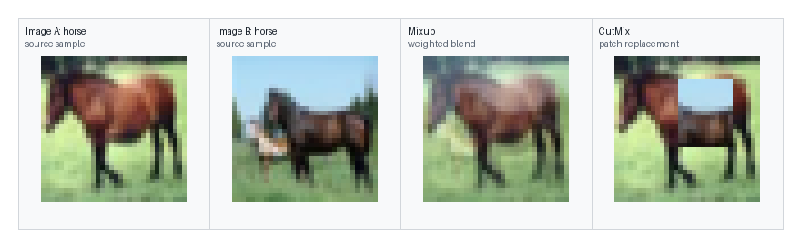

# Experiment Results Summary

This file summarises the selected experiment outputs included in `results/`.

## Core Research Trail

The project moved through four experimental stages:

1. Establish traditional low-data image classification baselines.
2. Represent augmentation policies as constrained JSON genotypes and evaluate one-shot or random LLM-like policies.
3. Use baseline-seeded ranked LLM evolution to generate mutation and crossover children.
4. Move the search into the FixMatch strong-augmentation branch, where strong augmentation has a clearer role in semi-supervised learning.

## Supervised Experiments

### Final Multi-Seed CIFAR-10 Supervised Comparison

| Method | Test accuracy | Test macro-F1 | Validation accuracy | Seeds | Interpretation |
|---|---:|---:|---:|---:|---|
| None | 35.52% +/- 1.15 | 34.47% +/- 1.96 | 37.30% +/- 0.17 | 3 | Lower-bound no-augmentation reference. |
| Standard | 44.88% +/- 1.24 | 43.40% +/- 1.42 | 45.57% +/- 2.15 | 3 | Simple crop/flip baseline remains competitive. |
| Mixup | 44.60% +/- 0.68 | 43.47% +/- 0.79 | 45.87% +/- 1.50 | 3 | More stable than the earlier single-seed impression suggested. |
| CutMix | 45.70% +/- 1.13 | 43.72% +/- 2.00 | 46.53% +/- 1.86 | 3 | Best supervised mean accuracy in the final comparison. |
| RandAugment | 44.78% +/- 3.16 | 43.58% +/- 2.73 | 45.57% +/- 2.37 | 3 | Competitive but seed-sensitive. |
| TrivialAugment | 39.02% +/- 1.99 | 35.99% +/- 3.90 | 39.00% +/- 2.01 | 3 | Weak under this short supervised low-data setting. |
| LLM evolved | 44.83% +/- 1.81 | 43.51% +/- 1.70 | 46.37% +/- 1.97 | 3 | Competitive with several local baselines, but not above CutMix. |

The final supervised result revises the earlier single-seed interpretation. The LLM-evolved policy is useful and competitive, but the strongest supervised mean result is CutMix.

### Earlier Supervised Exploration

| Dataset | Best local baseline | Best LLM/evolution result | Interpretation |
|---|---:|---:|---|
| CIFAR-10 early supervised run | RandAugment 43.97% | One-shot LLM 45.25%; LLM evolution 40.48% | Early LLM search was runnable but unstable. |
| Flowers102 early supervised run | TrivialAugment 47.47% | LLM evolution 31.86% | Conventional augmentation remained stronger. |
| EuroSAT early supervised run | Standard 75.75% | LLM evolution 68.68% | Strong augmentation can harm domain-specific signals. |
| CIFAR-10 strong OpenAI run | Mixup 48.50% | OpenAI-evolved `gen02_mut_005` 48.45% | Baseline-seeded ranked LLM evolution became competitive locally. |
| EuroSAT strong OpenAI run | No augmentation 73.95% | OpenAI-evolved `gen01_mut_002` 72.45% | Conservative policies were preferred in this setting. |

## FixMatch Experiments

### Final Multi-Seed CIFAR-10 FixMatch Comparison

| Method | Test accuracy | Test macro-F1 | Validation accuracy | Seeds | Final pseudo-label mask | Interpretation |
|---|---:|---:|---:|---:|---:|---|
| FixMatch Standard | 40.57% +/- 26.78 | 36.96% +/- 30.49 | 41.00% +/- 26.85 | 3 | 0.230 +/- 0.398 | Highly unstable under the current short training budget. |
| FixMatch RandAugment | 61.85% +/- 1.41 | 61.03% +/- 1.72 | 62.67% +/- 1.50 | 3 | 0.633 +/- 0.003 | Best and most stable final FixMatch method. |
| FixMatch TrivialAugment | 53.88% +/- 14.73 | 53.28% +/- 14.50 | 53.77% +/- 15.22 | 3 | 0.400 +/- 0.347 | High ceiling, but one run collapsed. |
| FixMatch LLM reused | 57.27% +/- 2.19 | 56.70% +/- 2.37 | 58.23% +/- 3.31 | 3 | 0.684 +/- 0.009 | Valid and reasonably stable, but below RandAugment. |
| FixMatch LLM repaired | 48.15% +/- 9.75 | 46.49% +/- 10.33 | 48.60% +/- 12.87 | 3 | 0.227 +/- 0.393 | Earlier single-seed improvement did not hold under multi-seed evaluation. |

The final FixMatch results show that RandAugment remains the strongest local method. The reused supervised LLM policy is a plausible strong branch, but the repaired in-loop LLM child is unstable and should be discussed as a prototype rather than a final improvement.

### Earlier Single-Seed FixMatch Exploration

| Method | Test accuracy | Test macro-F1 | Validation accuracy | Interpretation |
|---|---:|---:|---:|---|
| Supervised Mixup baseline | 48.50% | 46.30% | 47.40% | Best supervised local accuracy baseline. |
| Supervised LLM best | 48.45% | 47.22% | 50.20% | Best supervised LLM-evolved policy. |
| FixMatch standard | 56.75% | 55.12% | 56.60% | Unlabelled data improves absolute performance. |
| FixMatch reused LLM policy | 59.00% | 58.38% | 61.40% | Supervised LLM policy transfers usefully to FixMatch. |
| FixMatch repaired LLM child `mut_001` | 59.05% | 58.05% | 62.70% | In-loop LLM evolution is functional with a small gain over reuse. |
| FixMatch TrivialAugment | 61.50% | 61.08% | 63.00% | Strong canonical augmentation baseline. |
| FixMatch RandAugment | 62.05% | 61.05% | 63.90% | Current best local result. |

## Visual Results

## Included Result Directories

The included `results/` directory keeps selected successful experiment artefacts: tables, JSON summaries, policies, lineages, logs, and figures. It excludes model checkpoints and raw datasets.

Important files:

- `results/combined/all_method_summaries.csv`
- `results/combined/all_experiment_results.csv`
- `results/combined/final_multiseed/combined_multiseed_summary.csv`
- `FINAL_Multiseed_Experiment_Report.md`
- `results/cifar10_final_supervised_multiseed/tables/method_summary.csv`
- `results/cifar10_final_fixmatch_multiseed/tables/method_summary.csv`
- `results/cifar10_resnet18cifar_strong_openai/policies/gen02_mut_005.json`
- `results/cifar10_fixmatch_in_loop_openai/fixmatch_evolution_summary.json`
- `results/cifar10_fixmatch_repaired_llm_children/policies/fm_gen01_mut_001_repaired.json`
- `results/cifar10_fixmatch_llm_strong_policy/tables/fixmatch_results.csv`
