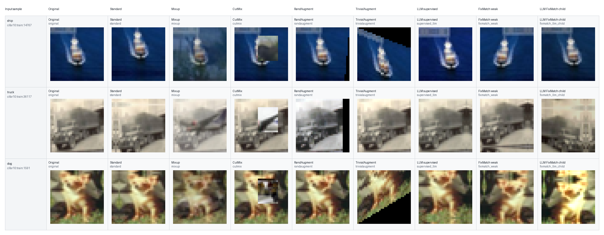
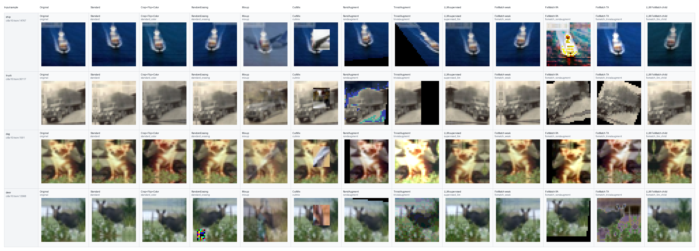
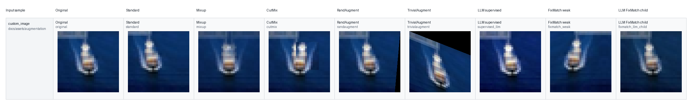

# Augmentation Example Images

This folder contains static example outputs generated by:

```bash
python scripts/export_augmentation_examples.py
```

The examples are intended for visual explanation only. They show what each augmentation method does to the input image; model quality should still be judged using the experiment tables in `results/`.

## Included Examples

Compact core-method grid:



Full method grid:



Custom image mode grid:



Each subfolder also contains an `individual/` directory with one PNG per sample and augmentation method, plus a `manifest.json` file describing the source sample, paired sample for Mixup/CutMix, and exported outputs.
