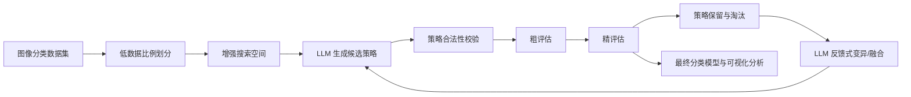

# 新版 Proposal：基于大模型引导进化搜索的图像增强策略优化及其在小样本图像识别中的研究

## 拟定题目

**基于大模型引导进化搜索的图像增强策略优化及其在小样本图像识别中的研究**

英文题目可暂定为：**LLM-Guided Evolutionary Search for Data Augmentation Policy Optimization in Low-Data Image Recognition**。

## 1. 研究方向调整说明

本研究将毕业项目收敛为一个纯计算机视觉与自动机器学习方向的课题。核心问题是：在标注数据有限、类别差异细微或图像分布存在变化的情况下，如何借助大语言模型的语义知识和进化搜索的探索能力，自动寻找更适合特定图像识别任务的数据增强策略，从而提升分类模型的泛化能力。

该方向以“大模型引导进化搜索”为方法骨架，将被优化对象设定为图像识别任务中的数据增强策略、训练策略或轻量模型配置。这样做有两个好处。第一，项目主体完全回到图像识别领域，实验会围绕 CIFAR、Flowers、EuroSAT 等标准图像分类数据集展开，更符合研究者已有技术积累。第二，自动数据增强本身是计算机视觉中成熟且有持续研究价值的问题，已有 AutoAugment、RandAugment、TrivialAugment、AugMix 等经典基线，便于开展可复现实验和定量比较。

新的研究不追求训练大型基础模型，也不要求生成新图像。大模型的作用不是替代 CNN 或 ViT 进行识别，而是在给定搜索空间和性能反馈的条件下，生成、改写和组合图像增强策略。系统通过短轮训练和验证集准确率评价候选策略，再用进化机制保留优秀策略、淘汰无效策略，并让大模型基于失败原因和性能反馈提出下一轮策略。最终目标是构建一个“LLM 提议策略、进化算法搜索策略、视觉模型验证策略”的闭环框架。

## 2. 研究背景与文献依据

图像识别模型通常依赖大量标注数据，但在细粒度分类、医学图像、遥感图像或课程项目环境中，标注样本往往有限。数据增强通过旋转、裁剪、翻转、颜色扰动、模糊、噪声、Mixup、CutMix 等方式扩展训练分布，是提升泛化能力的重要手段。然而，增强策略并不是越强越好。过弱的增强无法缓解过拟合，过强或不符合语义的增强可能破坏类别判别特征，甚至降低模型性能。因此，如何针对不同数据集和模型自动选择增强操作、概率、强度和组合方式，是图像识别中的重要问题。

AutoAugment 首次系统地将增强策略搜索建模为自动化学习问题，通过搜索得到适合数据集的增强 policy。RandAugment 则减少搜索空间，用少量参数实现实用的自动增强。TrivialAugment 进一步提出几乎不需要调参的增强方法，AugMix 则强调增强对分布偏移、鲁棒性和不确定性估计的帮助。2024 年的 AutoML 数据增强综述指出，自动化数据增强通常包含搜索空间设计、增强策略优化和模型评价三个环节，并且 AutoML 方法在很多图像任务中能够超过手工增强。

近两年，大语言模型开始被用于自动机器学习、神经架构搜索、超参数调优和数据增强策略优化。Adaptive Augmentation Policy Optimization with LLM Feedback 提出让 LLM 根据数据集特征、模型结构和验证性能反馈迭代调整增强策略。RZ-NAS 等工作也显示，LLM 可以通过自然语言反思、结构化提示和低成本代理评价参与神经架构搜索。与此同时，Evolution of Heuristics、FunSearch 以及 LLM 与进化算法结合的研究表明，LLM 适合生成候选程序或策略，而外部 evaluator 适合承担客观评价和筛选。由此，本项目可以将 LLM 的语义推理能力与进化搜索的黑箱优化能力结合，用于图像增强策略自动设计。

与已有工作相比，本项目的切入点不是简单调用 LLM 让它给出一组增强参数，而是建立一个可复现、可分析的策略演化框架。系统会限制增强搜索空间，记录每个候选策略的来源、操作组成、强度、验证表现和失败原因，并通过粗评估-精评估机制降低计算成本。论文不仅比较最终分类准确率，也分析策略演化过程，例如哪些增强操作更常被保留，不同数据集偏好的增强类型是否不同，LLM 反馈是否比随机搜索更有效。

### 2.1 联网检索依据

本 proposal 基于对自动数据增强、LLM 辅助 AutoML、LLM 与进化算法结合以及图像分类数据集的联网检索。检索结果显示，自动数据增强已经有清晰的经典基线：AutoAugment 将增强 policy 搜索建模为验证集性能驱动的自动化搜索问题；RandAugment 通过显著压缩搜索空间降低了自动增强的使用成本；TrivialAugment 提供了几乎无需调参的 dataset-independent baseline；AugMix 强调增强策略对分布偏移鲁棒性和不确定性估计的价值。这些工作为本研究提供了明确的对照组和评价基准。

近年也已经出现将 LLM 用于增强策略优化的直接相关研究。Adaptive Augmentation Policy Optimization with LLM Feedback 提出根据数据集特征、模型结构和性能反馈让 LLM 迭代调整增强策略，说明本项目的核心想法具有现实研究基础。另一方面，Evolution of Heuristics 和 LLM 与进化算法结合的综述表明，LLM 适合生成候选策略或启发式，而外部 evaluator 适合进行客观评价和选择。因此，本项目将 LLM 约束在“策略生成与反馈式改写”环节，将分类模型验证集性能作为外部评价器，是合理且可复现的技术路线。

数据方面，CIFAR-10 可通过 torchvision 直接下载，适合快速调试和标准对比；Flowers102 也有 torchvision 接口和 Oxford VGG 官方页面，包含 102 类花卉，类间相似度高，适合细粒度小样本识别；EuroSAT 提供 27,000 张 Sentinel-2 遥感图像和 10 个土地覆盖类别，适合验证增强策略在遥感图像域上的迁移能力。由此可见，数据集、基线方法和相关研究都可以支撑该课题。

### 2.2 可实施性讨论

本项目具备较强可实施性，原因在于它使用标准图像分类任务、成熟模型和可控搜索空间。数据集均可公开获取，CIFAR-10 和 Flowers102 可直接由 torchvision 管理，EuroSAT 也有公开下载链接和多种框架接口。模型方面，ResNet18、MobileNetV3-Small 或 ViT-Tiny 都可以直接使用 PyTorch / torchvision 实现或预训练权重。增强操作也可以通过 torchvision transforms 或 albumentations 构建，不需要从零实现复杂图像处理算法。

计算资源方面，项目不需要训练大型基础模型。建议使用 8GB 至 16GB 显存 GPU 完成主要实验；如果只跑 CIFAR-10 和 Flowers102 的小样本设置，Google Colab、Kaggle Notebook 或学校普通 GPU 基本足够。为了进一步降低训练成本，项目采用粗评估-精评估机制：先用较少 epoch 和较小候选池筛选策略，再对少数 top-k 策略进行完整训练。这样可以避免 AutoAugment 式大规模搜索带来的不可承受计算成本。

工程上，项目可以拆成数据加载、增强策略表示、策略校验、LLM 策略生成、进化搜索、模型训练和结果分析七个相对独立的模块。最小可交付版本只需要 CIFAR-10 和 Flowers102、ResNet18、6 个左右对照组、2 到 3 轮策略演化和 3 个随机种子，就能形成完整论文闭环。EuroSAT、MobileNetV3、Grad-CAM 和更多消融实验可以作为增强项，而不是主线完成的前提。

### 2.3 项目价值评估

本项目的学术价值在于连接了三个正在发展的方向：图像识别中的数据增强、AutoML/自动策略搜索，以及 LLM 辅助优化。传统自动增强方法往往依赖固定搜索空间和黑箱搜索，LLM 则能够根据数据域、类别语义和失败反馈提出更有解释性的策略修改。本研究不只是比较最终准确率，还会记录策略演化过程、操作频率、增强强度分布和失败原因，因此具有一定可解释性和分析价值。

本项目的实践价值在于小样本图像识别非常常见。许多真实任务无法获得大规模标注数据，研究者和工程师经常需要手工尝试不同增强组合。本项目若能证明 LLM 反馈式进化搜索可以在有限训练预算下找到更合适的增强策略，就可以为小数据视觉任务提供一种可复用的策略搜索框架。即使最终性能提升有限，策略校验、粗评估-精评估和跨数据集增强偏好分析也能形成有价值的工程经验。

从毕业论文角度看，该项目比单纯训练一个分类模型更有厚度。它不仅包含图像识别实验，还包含策略表示、自动搜索、LLM 反馈、消融实验和可视化分析。与过大的视觉基础模型课题相比，它的范围更可控；与普通分类实验相比，它的问题更明确、方法更有创新性、实验对照也更充分。

## 3. 核心研究问题

本研究建议收敛为以下五个研究问题。

RQ1：在小样本图像识别场景中，LLM 生成的数据增强策略是否比手工增强、随机增强和常见自动增强基线更有效？

RQ2：将 LLM 反馈与进化搜索结合，是否能够比一次性 LLM 推荐或随机搜索更稳定地找到高质量增强策略？

RQ3：粗评估-精评估机制能否在减少训练成本的同时保留高质量候选增强策略？

RQ4：不同图像数据集是否会演化出不同的增强偏好，例如自然图像、细粒度花卉图像和遥感图像对颜色扰动、几何变换、裁剪和混合增强的敏感性是否不同？

RQ5：能否通过策略谱系、增强样例、收敛曲线、混淆矩阵和特征可视化解释 LLM 引导策略演化为何有效或为何失败？

## 4. 总体技术路线

本项目采用“图像数据集、增强策略搜索、分类模型训练、性能反馈与策略演化”的闭环结构。首先选择一个或多个图像分类数据集，并构造低数据比例设置，例如每类只使用 10%、20% 或固定数量样本。然后定义增强搜索空间，包括几何变换、颜色变换、模糊/噪声、擦除、Mixup、CutMix 等操作。LLM 根据数据集描述、模型结构、已有策略表现和约束规则生成候选增强策略。每个策略会被转化为可执行的 torchvision 或 albumentations 配置，并通过 validator 检查操作是否合法、参数是否越界、是否可能破坏标签语义。

经过校验的候选策略进入进化搜索。系统先在较小模型、较少 epoch 或较小训练子集上进行粗评估，快速估计策略质量；再将排名靠前的策略放入完整训练或更多 epoch 的精评估。每轮演化保留表现较好的策略，并让 LLM 基于上一轮结果解释策略优缺点，提出变异、融合或修复后的新策略。最终选出的增强策略用于训练 ResNet18、MobileNetV3 或 ViT-Tiny 等图像分类模型，并与 No Augmentation、Standard Augmentation、AutoAugment、RandAugment、TrivialAugment 和 AugMix 进行比较。

## 5. 数据集与实验任务

本项目建议使用三类图像识别数据，既保证实验可跑，又能体现增强策略在不同视觉域中的差异。

第一类是 CIFAR-10 或 CIFAR-100。CIFAR-10 规模小、下载方便、训练速度快，适合调试 pipeline 和比较不同增强策略；CIFAR-100 类别更多、细粒度更强，可以作为难度更高的扩展实验。PyTorch torchvision 提供官方 dataset 接口，便于复现。

第二类是 Oxford Flowers 102。该数据集包含 102 类花卉，类别间存在相似外观，同一类别内有姿态、尺度和光照变化，适合研究细粒度识别中的增强策略选择。该数据集可通过 Oxford VGG 官方页面或 torchvision Flowers102 接口获取。

第三类是 EuroSAT。EuroSAT 基于 Sentinel-2 遥感图像，包含 10 类土地利用/覆盖类型，共 27,000 张标注图像。它与自然图像和花卉图像差异较大，可以检验 LLM 是否能根据数据域调整增强策略。例如，遥感图像中旋转和翻转通常更合理，但过强颜色扰动可能改变地物语义。

如果时间充足，可以加入 MedMNIST 的某个子集作为医学图像识别扩展，但不建议作为必做项。医学图像增强对语义约束要求更高，容易引入额外解释负担。

## 6. 方法设计

增强策略可以表示为若干子策略的集合。每个子策略由 1 到 3 个增强操作组成，每个操作包含名称、应用概率和强度参数。例如，一个策略可以包含 RandomResizedCrop、ColorJitter、RandomErasing 和 Mixup。为了保证可执行和可比较，所有候选策略都必须来自预定义操作库，参数也必须落在允许范围内。

LLM 的输入包括数据集描述、样本图像统计、类别数、模型架构、训练预算、上一轮候选策略的验证结果和失败原因。LLM 的输出不是自由文本，而是 JSON 或 Python dict 格式的策略配置。系统会对输出进行解析、修复和校验。若策略中包含不存在的操作、非法参数、概率越界或不适合该数据集的语义破坏性变换，则直接拒绝或自动修复。

进化搜索部分将增强策略视为种群个体。初始化阶段包含手工 baseline、随机策略和 LLM 初始策略。选择阶段根据验证准确率、宏平均 F1、训练稳定性和计算成本排序。变异阶段可以修改操作类型、强度、概率或操作顺序；交叉阶段可以融合两个表现较好的策略。LLM 参与的地方是根据性能反馈提出更有方向性的变异和融合，而不是完全替代进化算法。

粗评估-精评估机制用于控制计算成本。粗评估可以只训练 5 到 10 个 epoch，使用较小模型或训练子集；精评估对 top-k 策略训练更长 epoch，并在独立测试集上报告结果。论文需要分析粗评估排名与精评估排名之间的相关性，以证明该机制是否可靠。

## 7. 实验设计

实验一比较不同增强方法在低数据图像识别中的表现。对照组包括 no augmentation、standard augmentation、AutoAugment、RandAugment、TrivialAugment、AugMix、一次性 LLM 推荐策略和本文的 LLM-guided evolutionary policy。评价指标包括 Top-1 Accuracy、Macro-F1、训练时间和多随机种子均值/标准差。

实验二研究 LLM 反馈与进化搜索的作用。消融组包括随机搜索、不使用 LLM 反馈的纯进化搜索、一次性 LLM 推荐、LLM 反馈但不使用进化选择、完整 LLM 引导进化搜索。该实验回答 LLM 的贡献是否来自语义引导，而不是简单增加搜索次数。

实验三研究粗评估-精评估机制。比较不同粗评估 epoch 数、候选保留比例和 top-k 数量对最终性能和总训练时间的影响。该实验可以展示本项目在有限计算资源下的实用性。

实验四分析不同数据集的策略偏好。比较 CIFAR、Flowers 和 EuroSAT 最终保留策略中的操作频率、强度分布和组合模式，并展示增强前后的样例图。该实验让论文不仅有准确率表格，也能解释为什么不同视觉域需要不同增强。

实验五进行可解释性展示。使用混淆矩阵、Grad-CAM 或 t-SNE/UMAP 特征可视化观察增强策略是否改善了容易混淆类别的分类边界。该部分不必过度复杂，但会让论文更像图像识别项目，而不是单纯 AutoML 项目。

## 8. 计算资源需求

该项目更适合使用 GPU，但不需要大型算力。最低配置为 16GB RAM 的个人电脑加 CPU 或 Apple Silicon MPS，可以完成 CIFAR-10 和小规模 Flowers 实验，但训练速度较慢。推荐配置为一块 8GB 至 16GB 显存 GPU，例如 NVIDIA T4、RTX 3060、RTX 4060 或同级云 GPU；32GB RAM；50GB 至 100GB 可用存储。使用 Google Colab、Kaggle Notebook 或学校 GPU 即可完成主要实验。

为了控制训练成本，建议采用两级训练预算。粗评估阶段使用 ResNet18 或 MobileNetV3-Small，训练 5 到 10 个 epoch；精评估阶段训练 30 到 80 个 epoch，具体取决于数据集大小。CIFAR-10 可以跑更多随机种子，Flowers102 和 EuroSAT 可以减少策略数量但保留关键对照组。

LLM 部分建议使用 API，并对所有 prompt、response、策略配置、校验结果和评价结果进行本地缓存。这样既能降低成本，又能保证论文实验过程可追踪。

## 9. 预期贡献

本研究的第一项贡献是提出一个面向小样本图像识别的数据增强策略自动优化框架，将大语言模型的语义推理能力与进化搜索的探索能力结合起来。

第二项贡献是设计约束化的增强策略表示、策略合法性校验和反馈式策略演化机制，降低 LLM 输出不可执行或不适合图像任务的风险。

第三项贡献是引入粗评估-精评估机制，在有限训练预算下筛选高质量增强策略，并分析粗评估与精评估之间的可靠性。

第四项贡献是通过多个图像域的实验比较，分析自然图像、细粒度图像和遥感图像对增强操作的不同偏好，并通过增强样例、混淆矩阵和特征可视化增强结果解释性。

## 10. 风险与边界

本项目的主要风险是训练成本和变量数量过多。因此，研究边界必须清晰：本文不做图像生成，不训练扩散模型，不做目标检测或分割，不追求 ImageNet 级别大规模训练，也不扩展到图像分类以外的应用场景。项目聚焦于图像分类中的数据增强策略优化。

如果时间紧张，最小可完成版本应包括 CIFAR-10、Flowers102 两个数据集，ResNet18 一个主模型，五个对照组，以及 2 到 3 轮 LLM 引导策略演化。如果时间充足，再加入 EuroSAT、MobileNetV3 或 ViT-Tiny，以及更多消融实验。

## 参考资料与数据链接

- AutoAugment: Learning Augmentation Policies from Data. https://arxiv.org/abs/1805.09501
- RandAugment: Practical Automated Data Augmentation with a Reduced Search Space. https://arxiv.org/abs/1909.13719
- AugMix: A Simple Data Processing Method to Improve Robustness and Uncertainty. https://arxiv.org/abs/1912.02781
- TrivialAugmentWide in torchvision. https://docs.pytorch.org/vision/main/generated/torchvision.transforms.TrivialAugmentWide.html
- Data augmentation with automated machine learning: approaches and performance comparison with classical data augmentation methods. https://arxiv.org/html/2403.08352v2
- Adaptive Augmentation Policy Optimization with LLM Feedback. https://arxiv.org/html/2410.13453v3
- When Large Language Models Meet Evolutionary Algorithms. https://pmc.ncbi.nlm.nih.gov/articles/PMC11948732/
- RZ-NAS: Enhancing LLM-guided Neural Architecture Search via Reflective Zero-Cost Strategy. https://openreview.net/forum?id=9UExQpH078
- CIFAR-10 torchvision dataset. https://docs.pytorch.org/vision/stable/generated/torchvision.datasets.CIFAR10.html
- Oxford Flowers 102 official dataset. https://www.robots.ox.ac.uk/~vgg/data/flowers/102/
- Flowers102 torchvision dataset. https://docs.pytorch.org/vision/main/generated/torchvision.datasets.Flowers102.html
- EuroSAT dataset. https://github.com/phelber/eurosat
- EuroSAT Zenodo record. https://zenodo.org/records/7711810
