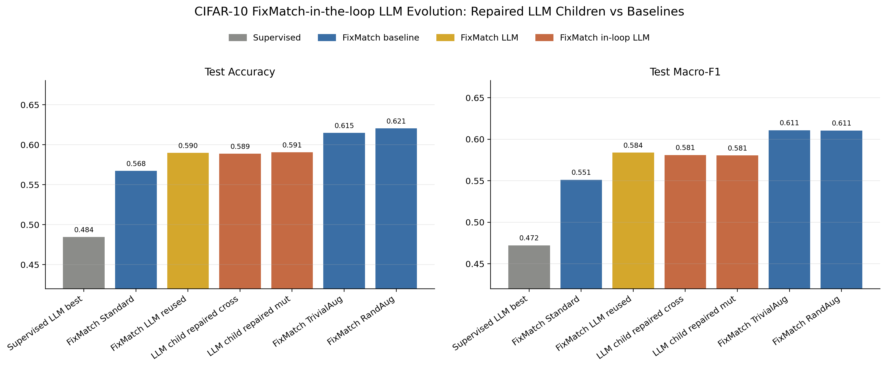

# FixMatch-in-the-loop LLM Evolution Experiment Report

Last updated: 2026-07-11

## Purpose

This experiment extends the previous FixMatch pilot from policy reuse to true in-loop evolution. Instead of taking the best supervised LLM-evolved policy and directly using it as the FixMatch strong branch, the new pipeline evaluates candidate policies under FixMatch rough training, sends the ranked FixMatch population back to the LLM, generates new strong-augmentation children, validates or repairs them, and then evaluates the best candidates under full FixMatch training.

This is a more meaningful research setting than ordinary supervised augmentation search because FixMatch depends directly on weak/strong augmentation consistency. The strong augmentation policy affects pseudo-label reliability, pseudo-label mask rate, and the noise of the unsupervised consistency loss.

## Implementation Summary

The following functionality was added:

| Component | Description |
|---|---|
| `src/image_aug_evolution/search/fixmatch_evolution.py` | FixMatch-aware evolutionary search loop using rough/full FixMatch fitness. |
| OpenAI chat mode | Added `api_mode: chat` because the Responses API path repeatedly timed out on this endpoint. |
| Policy repair layer | Added `repair_policy_for_search_space`, which trims LLM-generated policies to the local search-space constraints while preserving LLM intent. |
| `configs/cifar10_fixmatch_in_loop_openai.yaml` | Main in-loop OpenAI FixMatch evolution config. |
| `configs/cifar10_fixmatch_repaired_llm_children.yaml` | Full evaluation of repaired LLM-generated children. |

The final runnable setup used a compact but complete loop: four initial parents, two OpenAI-generated mutation children, rough FixMatch evaluation, and full evaluation of top candidates. The initial parents were `standard`, `randaugment`-inspired, `trivialaugment`-inspired, and the previous supervised OpenAI-evolved policy.

## API and Repair Notes

The OpenAI-compatible endpoint was unstable with the Responses API structured-output path: it produced empty outputs or read timeouts. A lighter Chat Completions JSON mode was therefore implemented and successfully used. The LLM-generated children were semantically meaningful but initially invalid because they exceeded the local constraint of at most three operations per sub-policy. This motivated a repair layer that truncates each sub-policy while preserving the highest-priority operations.

The two repaired LLM children were:

| Child | LLM Intent | Repair Effect |
|---|---|---|
| `fm_gen01_cross_000_repaired` | Conservative RandAugment-style policy with crop/flip plus color, rotation, and affine diversity. | Trimmed overlong sub-policies to valid three-operation groups. |
| `fm_gen01_mut_001_repaired` | Compact crop/flip/color policy with stronger ColorJitter than the supervised LLM policy. | Trimmed one overlong sub-policy to the first three operations. |

## Results

| Method | Test Accuracy | Test Macro-F1 | Validation Accuracy | Notes |
|---|---:|---:|---:|---|
| Supervised LLM best | 0.4845 | 0.4722 | 0.5020 | Previous supervised LLM-evolved best. |
| FixMatch `standard` | 0.5675 | 0.5512 | 0.5660 | Canonical weak-ish strong branch. |
| FixMatch reused supervised LLM policy | 0.5900 | 0.5838 | 0.6140 | Previous best supervised LLM policy reused as FixMatch strong branch. |
| FixMatch LLM child `cross_000` repaired | 0.5890 | 0.5809 | 0.6080 | Valid, competitive, but not better than reused LLM policy. |
| FixMatch LLM child `mut_001` repaired | 0.5905 | 0.5805 | 0.6270 | Slightly higher accuracy than reused LLM policy, but by only 0.05 percentage points. |
| FixMatch `trivialaugment` | 0.6150 | 0.6108 | 0.6300 | Strong canonical baseline. |
| FixMatch `randaugment` | 0.6205 | 0.6105 | 0.6390 | Best current result. |

## Analysis

The in-loop experiment demonstrates that the LLM can use FixMatch-ranked feedback to generate plausible strong augmentation policies. After repair, both children trained successfully and reached approximately 0.589-0.591 test accuracy. This is substantially above the supervised LLM result and close to the reused FixMatch LLM policy.

However, the method does not yet outperform canonical FixMatch baselines. RandAugment remains the strongest method with 0.6205 test accuracy, and TrivialAugment remains close behind with 0.6150. The best repaired LLM child improves over the reused LLM policy by only 0.0005 absolute accuracy, which is far too small to claim a meaningful improvement, especially under single-seed evaluation.

The main technical lesson is that a repair/constraint layer is necessary. Without it, the LLM tends to generate semantically reasonable but locally invalid policies by placing too many operations into one sub-policy. This is not a conceptual failure of LLM-guided evolution; it is an interface-design issue. For the dissertation, this is valuable because it shows why LLMs need to be embedded inside a validated evolutionary system rather than used as unconstrained policy generators.

The main methodological lesson is that FixMatch is sensitive and noisy under short local training budgets. Several policies showed late-epoch collapse, so best-validation checkpointing is important. Rough evaluation is useful for filtering obviously weak policies, but it is not reliable enough to determine final ranking by itself.

## Conclusion

This experiment completes a real FixMatch-in-the-loop LLM evolution prototype. It does not beat RandAugment or TrivialAugment, so the thesis should not claim SOTA-level augmentation discovery. The stronger and more honest claim is:

> FixMatch-aware LLM evolution can generate valid and competitive strong augmentation policies when combined with validation and repair, but the current single-generation search does not yet outperform canonical strong augmentation baselines. The result supports the value of LLM-guided policy search as an interpretable and extensible research framework, while highlighting the need for stronger constraint handling, multi-seed evaluation, and larger search budgets.

## Next Steps

The most valuable next experiment is not another hand-written policy. It should be a stronger automatic loop:

1. Use automatic repair before validation for every generated child.
2. Run two to three generations instead of one.
3. Increase rough evaluation reliability, for example six epochs or repeated rough seeds for top candidates.
4. Add a direct `RandAugment` operator or macro-operation to the policy search space, because the current JSON approximation is weaker than torchvision's canonical RandAugment.
5. Run at least three seeds for the final best LLM-evolved FixMatch policy and the RandAugment/TrivialAugment baselines.

