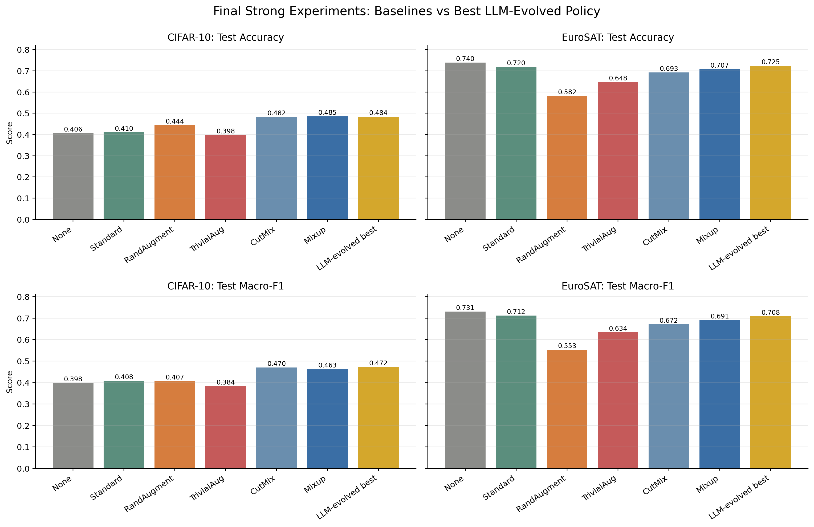
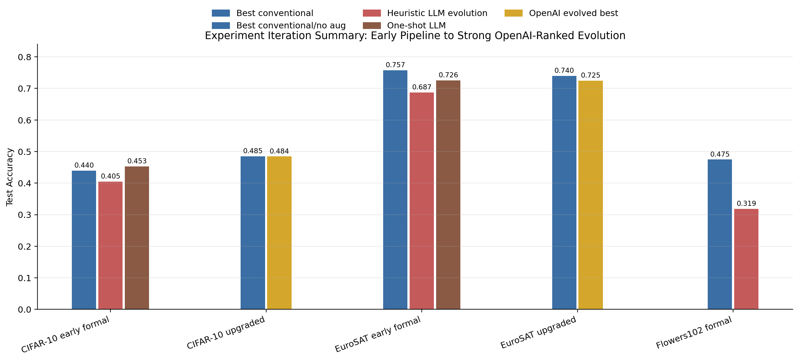
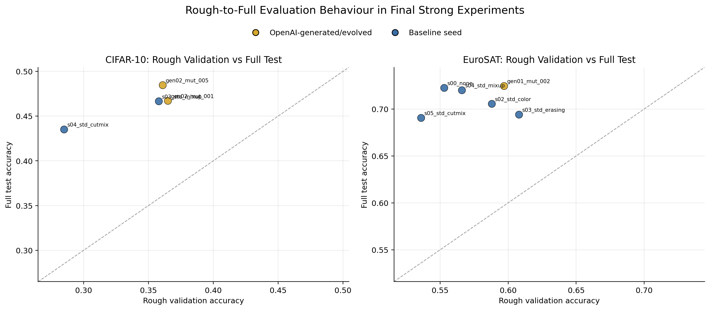
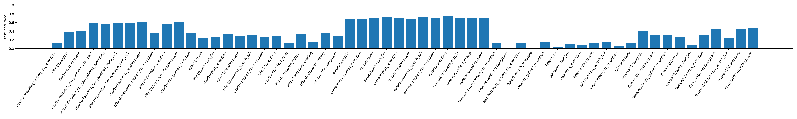
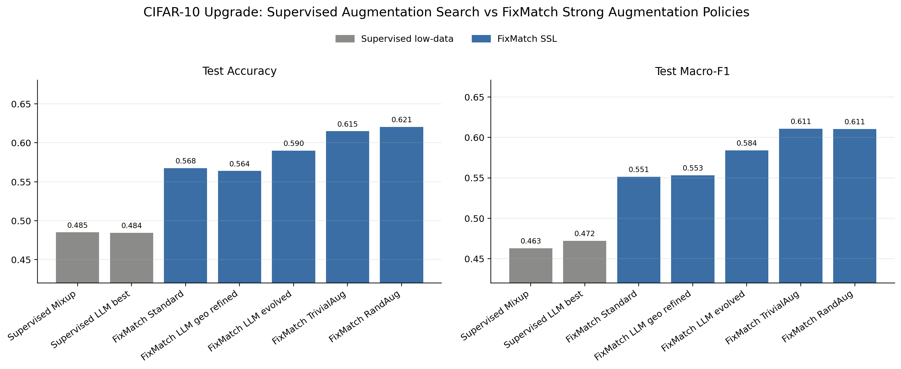

# 已完成实验报告：LLM-Guided Evolution for Low-Data Image Recognition

更新日期：2026-07-11

## 1. 实验目的与整体设计

本项目研究的问题是：在低数据图像识别场景中，大语言模型是否能够作为遗传算法中的语义变异与交叉算子，自动生成、改进并筛选数据增强策略，从而提升图像分类模型的泛化性能。与传统 AutoAugment、RandAugment、TrivialAugment 等方法相比，本项目关注的不是从固定搜索空间中盲目搜索，而是让 LLM 利用已有实验反馈、数据集特征和增强算子的语义约束，对候选策略进行更有方向的进化。

实验分为两个阶段。第一阶段是原始启发式 LLM/evolution pipeline，用于验证完整代码框架、数据加载、低数据划分、baseline 训练、one-shot LLM policy、random search、pure evolution 和 LLM-guided evolution 是否能够运行。该阶段覆盖 CIFAR-10、Flowers102 和 EuroSAT，但结果显示启发式 LLM 生成与进化策略不够稳定，整体弱于强增强 baseline。第二阶段是升级后的强范式实验，引入真实 OpenAI-compatible `gpt-5.5` structured policy generation、ranked population feedback、baseline-conditioned seeding、约束感知 mutation/crossover、policy validation、rough-to-full evaluation 和 CIFAR 适配的 `resnet18_cifar`。该阶段主要在 CIFAR-10 和 EuroSAT 上验证改进后的 LLM + evolution 是否能形成更有说服力的结果。

所有正式实验均在本地 Apple Silicon MPS 上完成。低数据设置固定使用较小训练集，以突出数据增强策略在样本不足条件下的作用。主要评价指标包括 validation accuracy、test accuracy、test macro-F1、rough evaluation 与 full evaluation 的一致性、policy operation frequency、policy complexity 和最终候选策略的可解释性。

## 2. 数据集、模型与实验设置

| 数据集 | 训练集 | 验证集 | 测试集 | 图像尺寸 | 主要模型 | 实验状态 |
|---|---:|---:|---:|---:|---|---|
| CIFAR-10 low-data | 1000 | 1000 | 2000 | 32 | `resnet18`, `resnet18_cifar` | 已完成 |
| Flowers102 low-data | 510 | 1020 | 2040 | 224 | `resnet18` | 已完成 |
| EuroSAT low-data | 1000 | 1000 | 2000 | 64 | `resnet18`, `resnet18_cifar` | 已完成 |

主要 baseline 包括 `none`、`standard`、`AutoAugment`、`RandAugment`、`TrivialAugment`、`AugMix`、`standard_mixup` 和 `standard_cutmix`。搜索方法包括 one-shot LLM policy、random search、pure evolution、启发式 LLM-guided evolution、adaptive ranked LLM evolution pilot，以及最终的 OpenAI-ranked LLM evolution。最终强实验使用 baseline seeding，初始种群中包含 `standard`、`standard_color`、`standard_erasing`、`standard_mixup`、`standard_cutmix` 和 conservative/no-augmentation 类型策略，使 LLM 不再从完全空白的策略空间中搜索，而是在强先验附近做语义局部搜索。

最终 OpenAI-ranked evolution 的目标函数以 validation accuracy 为主，同时加入 macro-F1、distortion proxy 和 policy complexity 的轻量约束。粗评估阶段使用较短训练轮数筛选候选策略，精评估阶段对排名靠前和重要 baseline seed 进行完整训练与测试。

## 3. 实验结果汇总

### 3.1 第一阶段：启发式 LLM/evolution 正式实验

第一阶段结果表明，早期 pipeline 虽然功能完整，但方法效果不足。启发式 LLM-guided evolution 在三个正式数据集上都没有稳定超过强 conventional augmentation。

| 数据集 | 最强 conventional baseline | One-shot LLM | LLM-guided evolution | Pure evolution | 主要观察 |
|---|---:|---:|---:|---:|---|
| CIFAR-10 | RandAugment: 0.4397 | 0.4525 | 0.4048 | 0.3995 | one-shot LLM 偶然较好，但多轮 evolution 未能稳定改进 |
| Flowers102 | TrivialAugment: 0.4747 | 0.0853 | 0.3186 | 0.3132 | 强 conventional augmentation 明显更可靠，LLM 策略泛化较弱 |
| EuroSAT | Standard: 0.7575 | 0.7255 | 0.6868 | 0.7107 | EuroSAT 对增强强度敏感，启发式 LLM evolution 低于 pure evolution |

这一阶段的结论是：单纯将 LLM 接入数据增强策略生成并不足以形成有效创新。没有 ranked feedback、强 baseline seed、严格 policy validation 和粗评估/精评估控制时，LLM 容易生成过强、过复杂或不适合数据集的策略。

### 3.2 第二阶段：OpenAI-ranked strong paradigm

升级后的实验结果更有论文价值。CIFAR-10 上，最终 OpenAI-evolved policy 基本追平最强 Mixup baseline，并在 macro-F1 上略有优势。EuroSAT 上，最佳方法仍是 no augmentation，但 LLM-evolved policy 超过 standard baseline，接近最优 no-augmentation 结果，说明搜索过程能够朝保守增强方向移动。

| 数据集 | 方法 | Test Accuracy | Test Macro-F1 | 说明 |
|---|---|---:|---:|---|
| CIFAR-10 | `standard_mixup` | 0.4850 | 0.4630 | 最强 accuracy baseline |
| CIFAR-10 | `gen02_mut_005` OpenAI-evolved best | 0.4845 | 0.4722 | accuracy 仅低 0.05 个百分点，macro-F1 高 0.92 个百分点 |
| CIFAR-10 | `standard_cutmix` | 0.4825 | 0.4697 | 强 conventional regularization |
| CIFAR-10 | `randaugment` | 0.4435 | 0.4072 | 明显低于 Mixup/CutMix 和 LLM-evolved best |
| EuroSAT | `none` | 0.7395 | 0.7306 | 最强整体结果 |
| EuroSAT | `gen01_mut_002` OpenAI-evolved best | 0.7245 | 0.7083 | 低于 no augmentation，但高于 standard |
| EuroSAT | `standard` | 0.7195 | 0.7122 | competitive baseline |
| EuroSAT | `standard_mixup` | 0.7070 | 0.6911 | Mixup 在 EuroSAT 上不如 CIFAR-10 有效 |
| EuroSAT | `randaugment` | 0.5815 | 0.5531 | 过强增强明显伤害遥感图像识别 |

CIFAR-10 的最佳 evolved policy 为 `gen02_mut_005`。该策略继承了 `standard_mixup` 的核心先验，使用 `RandomCrop`、`HorizontalFlip`、轻量 `ColorJitter` 和 `mixup_alpha = 0.2`，同时避免叠加 CutMix、VerticalFlip 或过强 erasing。它的意义不在于发明全新增强算子，而在于 LLM 能够根据 ranked feedback 保留有效先验并做小幅、可解释的局部改进。

EuroSAT 的最佳 evolved policy 为 `gen01_mut_002`。该策略采用较温和的 `RandomCrop`、水平/垂直翻转、极低概率的 `RandomErasing` 和轻量 `ColorJitter`，并完全关闭 Mixup/CutMix。该结果显示，LLM 在接收到 baseline evidence 后能够识别“该数据集不适合强混合增强”这一模式，但目前仍未超过 no-augmentation baseline。

## 4. 实验结果可视化

图 1 汇总了最终强实验中各 baseline 与最佳 LLM-evolved policy 的 test accuracy 和 test macro-F1。CIFAR-10 上，LLM-evolved best 与 Mixup/CutMix 处于同一水平；EuroSAT 上，no augmentation 仍然最好，但 LLM-evolved best 明显优于 RandAugment 和 Mixup。

图 2 展示了从第一阶段到第二阶段的方法迭代。早期启发式 LLM evolution 整体不稳定，而升级后的 OpenAI-ranked evolution 在 CIFAR-10 上取得了明显更强的结果。该图也说明 Flowers102 尚未进行同等级别的 OpenAI strong rerun，因此不能把 Flowers102 作为最终正结果。

图 3 展示了最终强实验中 rough validation accuracy 与 full test accuracy 的关系。CIFAR-10 的 Pearson correlation 为 0.911，但 Spearman correlation 只有 0.400；EuroSAT 的 Pearson correlation 为 0.482，Spearman correlation 为 0.371。这说明 rough evaluation 能大致排除很差的候选策略，但对最终排序仍不够可靠，后续需要更强的 surrogate 或更多 full evaluation budget。

已有的跨实验总览图也保存在：

## 5. 实验结果分析

现有实验支持一个比较清晰的判断：LLM-guided evolution 的价值主要体现在“约束下的语义局部搜索”，而不是从零发明全新的数据增强方法。第一阶段的失败很重要，因为它证明如果只让 LLM 直接生成策略，或者使用较弱的启发式 evolution，结果往往不如成熟 baseline。真正带来改善的是第二阶段的设计：将强 baseline 放进初始种群，将 ranked population 和 baseline reference 明确反馈给 LLM，并通过 policy validation 和 rough-to-full evaluation 限制无效搜索。

在 CIFAR-10 上，升级后方法产生了当前最有说服力的正结果。最佳 evolved policy 的 test accuracy 为 0.4845，仅比 `standard_mixup` 低 0.0005，但 macro-F1 从 0.4630 提升到 0.4722。考虑到低数据训练中类别表现可能不均衡，macro-F1 的改善说明该策略可能比单纯 Mixup 更有利于类别均衡泛化。不过，这一结果仍需多随机种子重复验证，目前不能声称统计显著优于 Mixup。

在 EuroSAT 上，结果更偏负面但很有解释价值。最佳 baseline 是 no augmentation，说明遥感图像在当前低数据设置下可能更依赖原始光谱/纹理结构，过强的 RandAugment、Mixup 或 CutMix 会破坏类别相关信息。LLM-evolved policy 没有超过 no augmentation，但它学会了关闭 Mixup/CutMix，并转向轻量 crop/flip/jitter，这说明 ranked LLM evolution 能够向正确的保守方向调整。该结果适合作为论文中的 dataset sensitivity case study。

从搜索机制看，rough-to-full evaluation 是当前 pipeline 的关键但也是限制。CIFAR-10 中 rough/full 的线性相关较高，但候选排序相关仍弱；EuroSAT 中两者相关性更低。这意味着粗评估可以节省计算预算，但如果用它直接决定最终策略，可能会错过真正泛化更好的候选。后续若要提高结果，需要改进候选选择机制，而不是简单增加 LLM 调用次数。

## 6. 还可提升的点

最优先的提升是进行多随机种子复现实验。最终强实验目前主要是单 seed，CIFAR-10 和 EuroSAT 都需要至少 3 个随机种子，并用 matched seeds 比较 `standard_mixup`、`standard_cutmix`、`none`、`standard` 和最终 LLM-evolved selection。没有这一步，论文可以说“有 promising evidence”，但不宜说“稳定优于 baseline”。

第二个提升是加入更严格的 ablation study。建议至少比较：无 LLM 的 pure evolution、无 baseline seeding、无 ranked prompt、无 baseline reference、无 rough-to-full inclusion、无 Mixup/CutMix seeds。这样才能证明效果来自 LLM-guided ranked evolution 的整体机制，而不是偶然继承了一个强 baseline。

第三个提升是扩展搜索预算。当前 final strong run 只有 2 generations，population 和 full evaluation budget 都较小。可以尝试 4 到 6 generations、更大的 offspring pool，以及保留 top-k diversity 的选择策略。但这需要控制 API 成本和训练时间。

第四个提升是改进 rough evaluation。可以使用 class-wise validation F1、early-learning curve features、训练损失稳定性、policy distortion proxy 和 small ensemble validation 来构建更可靠的 surrogate score。当前 rough/full 排序相关偏弱，是影响最终效果的重要瓶颈。

第五个提升是引入 semi-supervised learning，例如 FixMatch 或 Mean Teacher，并让 LLM evolution 专门优化 weak/strong augmentation policy。这是最可能显著提高 accuracy 的路线，但它会改变论文问题的范围。若目标是接近公开 SOTA，这条路线比继续微调 supervised low-data augmentation 更现实。

第六个提升是增强可解释性分析。可以加入每类 confusion matrix、class-wise F1、增强前后样本可视化、policy operation frequency 与性能关系、失败策略案例分析。这样即使最终 accuracy 没有超过强 baseline，论文仍能展示充分的机制洞察。

## 7. 对毕业论文的结论

基于现有实验，论文不应声称该方法接近或超过图像分类 SOTA。当前结果与公开 SOTA 仍有明显差距，尤其是 full-data、pretrained backbone 和 semi-supervised setting 下的强方法并不是同一实验设定。更稳妥且更有说服力的论文结论是：baseline-seeded ranked LLM evolution 可以作为一种有效的语义局部搜索机制，用于低数据图像识别中的数据增强策略优化。

论文可以将贡献概括为三个方面。第一，构建了一个完整可复现的 LLM-guided augmentation policy evolution pipeline，包括策略表示、合法性校验、ranked mutation/crossover、baseline seeding、rough-to-full evaluation 和结果分析。第二，通过多数据集实验发现，未经约束的 LLM 策略生成并不可靠，而强 baseline-conditioned ranked evolution 能够显著改善搜索质量。第三，实验揭示了数据集敏感性：CIFAR-10 受益于 Mixup-style regularization，LLM evolution 能够围绕该先验产生接近最优且 macro-F1 更高的策略；EuroSAT 则更适合无增强或轻量增强，过强增强会损害性能。

最终建议在论文中使用如下核心结论：

> This project does not claim to outperform image-classification state of the art. Instead, it demonstrates that baseline-seeded ranked LLM evolution can serve as a constrained and interpretable semantic local-search mechanism for augmentation policy optimization in low-data image recognition. The method is most useful when the LLM is guided by empirical baseline evidence and strict policy constraints; without these constraints, LLM-generated policies are unstable and often weaker than conventional augmentation baselines.

## 8. 主要结果文件

| 内容 | 路径 |
|---|---|
| CIFAR-10 final baseline results | `results/cifar10_resnet18cifar_strong_openai/tables/baseline_results.csv` |
| CIFAR-10 final evolution records | `results/cifar10_resnet18cifar_strong_openai/tables/evolution_records.csv` |
| CIFAR-10 best evolved policy | `results/cifar10_resnet18cifar_strong_openai/policies/gen02_mut_005.json` |
| EuroSAT final baseline results | `results/eurosat_resnet18cifar_strong_openai/tables/baseline_results.csv` |
| EuroSAT final evolution records | `results/eurosat_resnet18cifar_strong_openai/tables/evolution_records.csv` |
| EuroSAT best evolved policy | `results/eurosat_resnet18cifar_strong_openai/policies/gen01_mut_002.json` |
| Combined method summaries | `results/combined/all_method_summaries.csv` |
| Combined accuracy pivot | `results/combined/final_accuracy_pivot.csv` |
| Final strong result figure | `results/combined/completed_experiment_visuals/final_strong_accuracy_macro_f1.png` |
| Iteration summary figure | `results/combined/completed_experiment_visuals/experiment_iteration_summary.png` |
| Rough/full scatter figure | `results/combined/completed_experiment_visuals/rough_full_final_scatter.png` |

## 9. 新增实验：FixMatch + LLM-evolved strong augmentation policy

在原有 supervised low-data 实验基础上，项目进一步加入了 FixMatch-style semi-supervised learning。这个方向不是单纯为了让结果数字更好看，而是因为 FixMatch 的核心机制本身依赖 weak/strong augmentation consistency；strong augmentation policy 的选择会直接影响 pseudo-label 的可靠性和一致性训练效果。因此，将 LLM-evolved policy 放入 FixMatch strong branch，是对原研究问题的自然扩展。

新增实现包括 semi-supervised dataloader、unlabeled weak/strong 双视图、FixMatch training loop、pseudo-label confidence threshold、policy-file evaluation，以及与 `experiments/run_experiment.py` 的统一入口集成。主要配置文件为 `configs/cifar10_fixmatch_llm_strong_policy.yaml`，使用 CIFAR-10 的 100/class labeled training set、100/class validation set、10,000 unlabeled images 和 2,000 test images。

| 方法 | Test Accuracy | Test Macro-F1 | 说明 |
|---|---:|---:|---|
| Supervised `standard_mixup` | 0.4850 | 0.4630 | 原 supervised strong run 的最强 accuracy baseline |
| Supervised LLM best `gen02_mut_005` | 0.4845 | 0.4722 | 原 supervised LLM-evolved best |
| FixMatch `standard` | 0.5675 | 0.5512 | 半监督信号带来明显提升 |
| FixMatch LLM geo-refined candidate | 0.5640 | 0.5532 | 手工加入轻量 geometry refinement 未能提升 |
| FixMatch LLM-evolved policy | 0.5900 | 0.5838 | 复用 supervised LLM-evolved policy 作为 strong branch |
| FixMatch `trivialaugment` | 0.6150 | 0.6108 | 强 conventional SSL augmentation baseline |
| FixMatch `randaugment` | 0.6205 | 0.6105 | 当前 FixMatch pilot 最好结果 |

该实验给出了一个更强但也更诚实的结论：FixMatch 明显提升了低数据 CIFAR-10 结果，最佳 test accuracy 从 supervised 阶段约 0.485 提升到 0.6205；LLM-evolved policy 在 FixMatch 下也提升到 0.5900，说明它作为 strong augmentation branch 是有效候选。然而，它尚未超过 RandAugment/TrivialAugment，因此不能声称 LLM policy 已经优于 canonical SSL augmentation baseline。

这反而让下一步研究问题更清晰：不应继续手工调整 supervised 阶段得到的 LLM policy，而应开展 FixMatch-in-the-loop LLM evolution。也就是说，让 LLM 根据 FixMatch 下的 ranked population feedback 直接进化 strong augmentation policy，而不是把 supervised augmentation search 的最佳策略迁移过来。完整小报告见 `FIXMATCH_Upgrade_Experiment_Report.md`。
