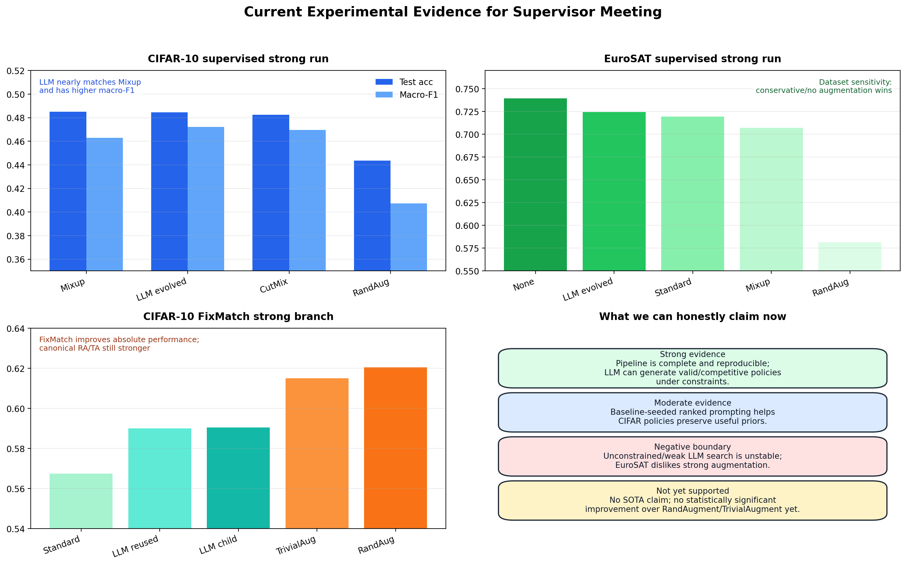
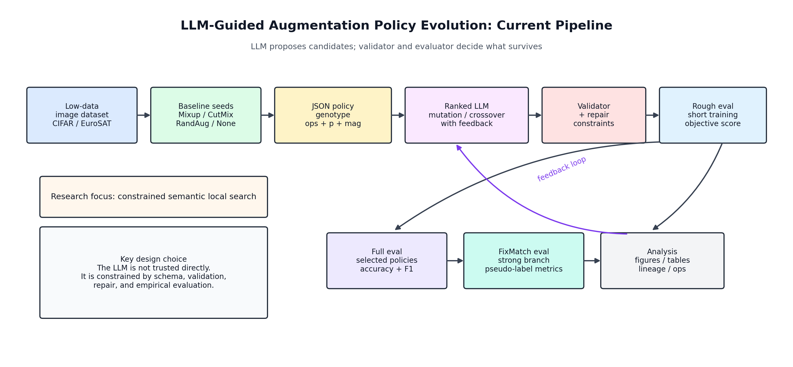
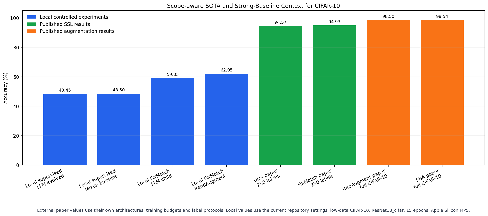

## Summary

The project has evolved from an initial idea of asking an LLM to generate image augmentation policies into a more controlled research framework: the LLM is used as a semantic mutation and crossover operator inside an evaluator-controlled evolutionary search loop. Candidate policies are represented as constrained JSON objects, checked by a validator, optionally repaired, evaluated through supervised or FixMatch training, and selected through ranked feedback.

The current evidence supports a focused research claim. Unconstrained or weakly constrained LLM augmentation search is unstable. Baseline-seeded ranked LLM evolution is more reliable: on CIFAR-10 supervised low-data classification, the best OpenAI-evolved policy almost matches the strongest local Mixup baseline in test accuracy and achieves a slightly higher macro-F1. In EuroSAT, the results show that conservative or no augmentation is preferable under the current setting. In FixMatch, semi-supervised learning improves the absolute CIFAR-10 accuracy substantially, and the in-loop LLM evolution prototype successfully generates valid strong-branch policies after repair. The current LLM-evolved FixMatch policies remain below RandAugment and TrivialAugment, so the next phase should focus on multi-seed evaluation, ablation studies, and a stronger FixMatch-in-the-loop search budget.

## Current Research Question

The project now focuses on the following research question:

**Can baseline-seeded ranked LLM evolution generate valid, interpretable, and competitive data augmentation policies for low-data image recognition, especially when the search is placed inside the FixMatch strong-augmentation branch?**

This question keeps the project aligned with the original computer vision topic while giving the method a clearer research contribution. The emphasis is on a reproducible search framework, controlled LLM policy generation, policy validation and repair, and empirical analysis against strong local baselines.

## Methodology Overview

The method is an evaluator-controlled LLM evolution loop. The LLM proposes candidate augmentation policies, and acceptance is determined by the local training evaluator.

The pipeline has five main components. First, augmentation policies are encoded as JSON genotypes containing operations, probabilities, magnitudes, and optional Mixup/CutMix parameters. Second, all policies pass through a validator that checks operation names, parameter ranges, sub-policy length, and dataset-specific warnings. Third, the initial population is seeded with strong conventional baselines such as standard augmentation, Mixup, CutMix, RandAugment, TrivialAugment, and no augmentation. Fourth, the LLM receives ranked population feedback and generates mutation or crossover children. Fifth, rough-to-full evaluation screens candidates cheaply before selected policies receive fuller evaluation.

The latest method extends this loop to FixMatch. In this setting, weak augmentation produces pseudo-labels and strong augmentation is used for consistency training. This makes the strong augmentation branch a natural target for LLM-guided policy evolution.

## Experiment Results

### Supervised Experiments

| Dataset | Best local baseline | Best LLM/evolution result | Interpretation |
|---|---:|---:|---|
| CIFAR-10 early supervised run | RandAugment 43.97% | One-shot LLM 45.25%; LLM evolution 40.48% | Early LLM search was runnable but unstable. |
| Flowers102 early supervised run | TrivialAugment 47.47% | LLM evolution 31.86% | Conventional augmentation remained stronger. |
| EuroSAT early supervised run | Standard 75.75% | LLM evolution 68.68% | Strong augmentation can damage domain-specific signals. |
| CIFAR-10 strong OpenAI run | Mixup 48.50% | OpenAI-evolved `gen02_mut_005` 48.45% | Baseline-seeded ranked LLM evolution became competitive. |
| EuroSAT strong OpenAI run | No augmentation 73.95% | OpenAI-evolved `gen01_mut_002` 72.45% | Conservative policies are preferred in this setting. |

The strongest supervised result is on CIFAR-10. The best OpenAI-evolved policy keeps RandomCrop, HorizontalFlip, light ColorJitter, and Mixup with `mixup_alpha=0.2`. This is a meaningful result because the LLM preserves the strongest local baseline prior and makes a small, interpretable modification while avoiding an overly complex policy.

### FixMatch Experiments

| Method | Test accuracy | Test macro-F1 | Validation accuracy | Interpretation |
|---|---:|---:|---:|---|
| Supervised Mixup baseline | 48.50% | 46.30% | 47.40% | Best supervised local accuracy baseline. |
| Supervised LLM best | 48.45% | 47.22% | 50.20% | Best supervised LLM-evolved policy. |
| FixMatch standard | 56.75% | 55.12% | 56.60% | Unlabelled data improves performance. |
| FixMatch reused LLM policy | 59.00% | 58.38% | 61.40% | Supervised LLM policy transfers usefully to FixMatch. |
| FixMatch repaired LLM child `mut_001` | 59.05% | 58.05% | 62.70% | In-loop LLM evolution is functional, with a very small gain over reuse. |
| FixMatch TrivialAugment | 61.50% | 61.08% | 63.00% | Strong canonical augmentation baseline. |
| FixMatch RandAugment | 62.05% | 61.05% | 63.90% | Current best local result. |

The FixMatch experiments confirm that semi-supervised learning is a better setting for studying strong augmentation policies. The best local accuracy rises from 48.50% in supervised training to 62.05% with FixMatch RandAugment. The best in-loop LLM child reaches 59.05%, which is useful and valid but still behind canonical strong augmentation.

## SOTA and Strong-Baseline Context

External papers provide an important reference point. UDA reports 94.57% CIFAR-10 accuracy in a 250-label semi-supervised protocol, and FixMatch reports 94.93% under a similar protocol. Full-data automated augmentation methods such as AutoAugment and Population Based Augmentation report approximately 98.5% CIFAR-10 accuracy under much larger training and search budgets. These numbers are not directly comparable to my local 15-epoch, ResNet18-CIFAR, student-scale experiments. They show the performance gap and help define future improvement targets.

The dissertation should therefore make local strong-baseline claims and use SOTA papers as external context. The current contribution is the implementation and analysis of a controlled LLM-guided augmentation policy evolution framework, including baseline seeding, ranked LLM feedback, validation, repair, rough-to-full evaluation, and FixMatch-aware strong-branch policy search.

## Completed Work and Remaining Work

| Work item | Status | Evidence | Remaining action |
|---|---|---|---|
| Literature review and research narrowing | Completed, needs final update | Introduction/background and reference library updated | Add final experimental interpretation to Discussion. |
| Dataset preparation and low-data splits | Completed | CIFAR-10, Flowers102, EuroSAT loaders and deterministic splits | Keep CIFAR-10 and EuroSAT as core final datasets. |
| Supervised baseline pipeline | Completed | Baseline result tables and combined summaries | Add selected multi-seed reruns. |
| JSON policy schema, transform builder, validator | Completed | Policy, builder, and validator modules | Present as core engineering contribution. |
| Baseline-seeded ranked OpenAI evolution | Completed | CIFAR-10 and EuroSAT strong OpenAI results | Analyse policy lineage and operation frequency. |
| FixMatch training and policy reuse | Completed | FixMatch standard, RandAugment, TrivialAugment, and LLM policy results | Add per-class diagnostics. |
| FixMatch-in-the-loop LLM evolution | Prototype completed | Repaired LLM children evaluated under FixMatch | Extend to 2-3 generations and larger offspring pool. |
| Policy repair layer | Prototype completed | Invalid LLM children repaired and evaluated | Add repair-rate and repair-impact analysis. |
| SOTA/strong baseline comparison | Completed for progress report | SOTA context figure and verified references | Convert into thesis discussion subsection. |
| Ablation studies | Not completed | No complete ablation table yet | Run baseline seeding, ranked feedback, repair, and rough/full ablations. |
| Statistical reliability | Not completed | Most strong runs are single seed | Run 3-seed comparisons for final policies and baselines. |
| Thesis Methodology | Draft completed | Methodology LaTeX chapter created | Revise after supervisor feedback. |
| Results, Discussion, Conclusion chapters | Not completed | Existing reports and figures available | Write final chapters after additional experiments. |

The next phase should prioritise reliability and dissertation readiness. The immediate plan is to run multi-seed final comparisons, add ablations, extend the FixMatch-in-loop search, and then convert the current experiment reports into the Results and Discussion chapters.

## Risks and Mitigation

The main risk is statistical reliability. Several key experiments are single-seed, and the difference between the best supervised LLM policy and Mixup is extremely small. I will mitigate this by running at least three seeds for the final CIFAR-10 FixMatch baselines and the best LLM-evolved policies.

The second risk is rough-to-full ranking noise. Rough evaluation helps filter weak policies, but it does not always predict final performance reliably, especially in FixMatch. I will analyse rough/full correlation and consider repeated rough seeds for shortlisted candidates.

The third risk is search-space mismatch. The current JSON policy space approximates RandAugment-like behaviour, while torchvision RandAugment and TrivialAugment are stronger canonical implementations. I will consider adding RandAugment or TrivialAugment as macro-operations in the search space.

## References

- FixMatch: https://arxiv.org/abs/2001.07685
- UDA: https://arxiv.org/abs/1904.12848
- ReMixMatch: https://arxiv.org/abs/1911.09785
- AutoAugment: https://arxiv.org/abs/1805.09501
- Population Based Augmentation: https://proceedings.mlr.press/v97/ho19b.html
- RandAugment: https://papers.nips.cc/paper/2020/hash/d85b63ef0ccb114d0a3bb7b7d808028f-Abstract.html
- TrivialAugment: https://openaccess.thecvf.com/content/ICCV2021/html/Muller_TrivialAugment_Tuning-Free_Yet_State-of-the-Art_Data_Augmentation_ICCV_2021_paper.html
- FunSearch: https://www.nature.com/articles/s41586-023-06924-6
- LLM feedback augmentation policy optimisation: https://arxiv.org/abs/2410.13453
